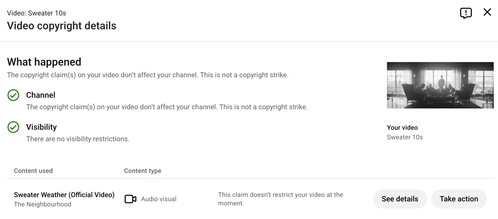
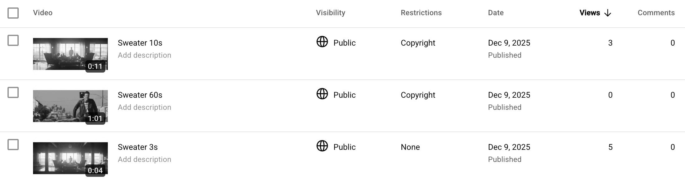

Nick Rinaldi (nickrinaldi)  
CMSC 23206  
December 2025  
Prof. Nick Feamster

### 1. Platform Analysis

My chosen platform is YouTube (test account: `@nick-security-copyright`).

- **Detection**: Automated Content ID fingerprints audio and video; matches can be set by rightsholders to monetize, block, or track. Separate from Content ID, YouTube also processes manual reports and DMCA takedown notices that can lead to removals and strikes.
- **When flagged**: A Content ID match results in a claim (not a strike) with a policy chosen by the claimant—monetize, block (global/territorial), mute/trim, or track. DMCA notices can remove content and issue strikes; repeat strikes risk channel termination.
- **Appeals/counter**: Creators can dispute Content ID claims; claimants may release, uphold, or escalate. After a claim is upheld, a counter-notification is possible under DMCA, shifting risk to the uploader. Strikes from DMCA can also be appealed via counter-notice.
- **Monetization handling**: For claimed videos, revenue can be redirected to the rightsholder (monetize), disabled (block/mute), or left with the uploader if the claim is released. Some Content ID partners can share revenue on eligible uploads.
- **Special programs**: Content ID access is restricted to qualified partners and distributors that supply reference files and accept liability; ordinary users rely on the dispute/counter flows.
- **Policy vs. observed behavior**: The official policy promises automated fingerprinting plus DMCA processes. In our experiments (see sections 2 and 3), Content ID monetized recognizable raw clips (10s/60s), missed a 3s snippet, and did not match AI-generated videos, indicating gaps tied to fingerprint coverage/thresholds rather than legal doctrine.

### 2. Fair Use Experiments

My objective was to evaluate YouTube's enforcement behavior on short raw clips of a copyrighted music video. I uploaded three unaltered clips of different lengths from *The Neighbourhood — Sweater Weather (Official Video)*:

- `sweater_60s.mp4` (60 seconds) [Watch on YouTube](https://youtu.be/uiOwoPUgFXg)
  - Detection: immediate Content ID match
  - Outcome: claim with policy "Allowed / monetized by owner"
  - The video stayed public with no strike or visibility limits
  - Options shown: acknowledge or dispute/trim
  - This shows the system reliably fingerprints a substantial excerpt and routes revenue to the rightsholder

- `sweater_10s.mp4` (10 seconds) [Watch on YouTube](https://youtu.be/w1Tv04OTllY)
  - Despite the brevity, the exact same result occurred as above
  - Even short excerpts containing the recognizable audio hook are sufficient for a match
  - Here's what these two copyright claims looked like:

   

- `sweater_3s.mp4` (3 seconds) [Watch on YouTube](https://youtu.be/PNPpBHcnOGg)
  - Detection: none
  - Outcome: still no Content ID claim
  - This ultra-short clip produced no Content ID claim
  - The dashboard view of all three uploads is captured here: 

### 3. AI Content Investigation

I used OpenAI's Sora to generate video content testing how AI-generated material is treated on YouTube, with particular focus on what happens when prompts reference copyrighted works versus original concepts.

Sora's own content policy blocked multiple direct or near-direct references to copyrighted intellectual property at generation time. First, I tried to generate Spider-Man, but Sora's guardrails blocked all attempts with the message "This content may violate our guardrails concerning similarity to third-party content." Failed prompts included:

- "A cinematic scene of Spider-Man swinging through New York City at night, with neon signs and traffic below, shot in the style of Marvel Studios productions."
- "A cinematic scene of a spider-themed superhero swinging through New York City at night, with neon signs and traffic below, shot in the style of Hollywood superhero productions."
- "A cinematic scene of a person in red and blue athletic wear with web-like patterns, swinging between skyscrapers at night in a sprawling city, with neon signs and traffic, shot in the style of modern action films."
- "A video of a masked acrobat in superhero costume swinging through an urban skyline at night, performing parkour-like movements between buildings, high-energy action cinematography."

Even the last one! It appears that Sora's guardrails operate at two levels: blocking direct IP references (Spider-Man, Marvel Studios) and blocking recognizable character/scene descriptors even without naming them (superhero costume, specific visual markers). Named franchises and specific titles triggered consistent denials:

- "A short video in the style of *Avatar: The Last Airbender*, showing a young bald man in blue arrow tattoos practicing martial arts in a mountain temple, with water bending effects, anime aesthetic."
- "A dramatic scene inspired by *The Matrix*, a person in sunglasses and dark coat in a rain-soaked city at night, moving in slow-motion with green digital effects and falling code."
- "A young woman with long blonde hair singing in a tower surrounded by floating lanterns, inspired by Disney's *Tangled*, watercolor animation style."
- "A short video in the style of *Spirited Away*: a young girl walking through a mystical bathhouse with Japanese architecture, encountering fantastical creatures and spirits, soft watercolor animation, magical glowing effects, peaceful and haunting atmosphere."

However, I would later have success with a prompt similar to the final one, which replaced the specific title *Spirited Away* with "Studio Ghibli."

1. **Style Mimicry (Studio Ghibli)** [Watch on YouTube](https://youtube.com/shorts/9dVkpcyL1Mg)
   - Prompt: "A short video in the style of Studio Ghibli: a young girl walking through a mystical bathhouse with Japanese architecture, encountering fantastical creatures and spirits, soft watercolor animation, magical glowing effects, peaceful and haunting atmosphere."
   - Result: Successfully generated and uploaded `spirited_away.mp4`. No Content ID claim. No copyright violation. The removal of the specific title *Spirited Away* allowed generation to proceed, suggesting Sora's guardrails distinguish between named intellectual property and general artistic styles. YouTube's treatment mirrors this: the generalized style reference generated no automated enforcement action.

2. **Control/Original Concept (Skyscraper Meditation)** [Watch on YouTube](https://youtube.com/shorts/aRABdW3JU4k)
   - Prompt: "A man calmly filming himself with a selfie stick, perched at the very top of a skinny building in Billionaires' Row, overlooking Central Park on a windy day. He has no harness and is silently meditating."
   - Result: Successfully generated and uploaded `skyscraper_meditation.mp4`. No Content ID claim. No copyright violation. This baseline demonstrates that original prompts with no copyrighted references generate without friction both at the AI tool and on the platform.

Neither upload triggered any automated copyright claim or warning. YouTube did not flag them as AI-generated, and no Content ID matches occurred despite the Ghibli-styled video's visual similarity to existing animated works.

**Sora's TOS on copyright**: OpenAI's terms state that users retain ownership of their generated outputs, subject to OpenAI's usage policies and restrictions. The agreement explicitly disclaims any guarantee that outputs are free from third-party copyright claims. Users are responsible for ensuring their use of generated content complies with applicable copyright law and does not infringe on others' rights.

**Copyright ownership of AI-generated content**: Under Sora's terms, the user owns the generated output. However, U.S. copyright law requires human authorship for copyright protection. Courts and the U.S. Copyright Office have indicated that purely AI-generated works may not be copyrightable, potentially placing them in the public domain. This creates ambiguity: even if you "own" the output per Sora's agreement, it may not receive copyright protection, and third parties could arguably copy it freely. Conversely, if your output closely mimics existing copyrighted works, the rightsholder's claim would likely supersede any copyright you might claim.

**YouTube's policy on AI-generated content**: YouTube does not have an explicit copyright policy addressing AI-generated submissions. Content ID enforcement applies uniformly to all uploads regardless of origin. However, YouTube requires creators to disclose "altered or synthetic" media in certain contexts (e.g., realistic depictions of sensitive topics), though this is a transparency and misinformation policy, not a copyright enforcement mechanism. As observed in our experiment, YouTube does not flag AI-generated videos as ineligible or apply special copyright enforcement to them; they are treated like any other user upload, subject to the same Content ID and DMCA processes.

### 4. Legal Analysis

**Fair Use Assessment for Raw Clips**

(a) **Purpose and character of use:** The uploads are purely duplicative—no transformation, commentary, criticism, or educational value. They are non-commercial in the sense that I did not attempt monetization, but YouTube's Content ID routed revenue to the rightsholder, indicating the platform recognized market value. This weighs heavily against fair use.

(b) **Nature of the copyrighted work:** *Sweater Weather* is a creative audiovisual work (music video), which receives strong copyright protection. Factual works receive weaker protection; creative works do not. This factor weighs against fair use.

(c) **Amount and substantiality of the portion used:** The 60-second clip is substantial—it includes the recognizable hook and a significant portion of the song. The 10-second clip, though brief, captures the most recognizable part of the work (the audio signature), which may constitute the "heart" of the original. The 3-second clip is de minimis in length. Courts have held that even small amounts can weigh against fair use if they capture the essence of the work. For the 10s and 60s uploads, this factor weighs against fair use; for the 3s upload, the brevity may weigh slightly in its favor, but the lack of a claim suggests YouTube's fingerprinting has a threshold.

(d) **Effect on the market for the original:** YouTube's "Allowed / monetized by owner" policy explicitly shows market harm was recognized—the rightsholder asserted a claim on the 10s and 60s clips, demonstrating they have market interest in controlling use of even short excerpts. The 3s clip received no claim, suggesting it falls below a detectability or market-impact threshold. Overall, the platform's enforcement behavior indicates the rightsholders view these uploads as competing with or impacting their market, weighing against fair use for the longer clips.

All three raw clips fail the fair use test under traditional analysis. They are non-transformative, derivative of a creative work, and subject to market claims. The 10s and 60s uploads are particularly indefensible, and the 3s clip's status is ambiguous—unclaimed by Content ID, but likely still infringing if the rightsholder pursued manual enforcement.

**Gap Analysis**

Under the four fair use factors, all three raw clips fail. They are non-transformative, purely duplicative copies of a creative work, and the rightsholders have demonstrated market interest in controlling them. Legally, they should be indefensible under fair use, and the 10s and 60s uploads clearly are. However, the 3-second clip presents an edge case—it is de minimis in length and was not detected by Content ID, yet it is almost certainly still infringing under copyright law regardless of detection. This reveals a technical threshold below which fingerprinting does not operate reliably. YouTube's actual enforcement is driven more by technical fingerprinting capability than by copyright law, so platform policy and legal doctrine slightly diverge in practice.

### 5. Appendix

**Screenshots**

- `screenshots/10s_copyright_claim.png` — Content ID claim panel for `sweater_10s.mp4`
- `screenshots/three_videos.png` — YouTube dashboard view showing all three raw clip uploads

**Uploaded Content**

Fair Use Experiments:
- `sweater_60s.mp4` (60s, Content ID "Allowed / monetized") — [Watch on YouTube](https://youtu.be/uiOwoPUgFXg)
- `sweater_10s.mp4` (10s, Content ID "Allowed / monetized") — [Watch on YouTube](https://youtu.be/w1Tv04OTllY)
- `sweater_3s.mp4` (3s, no claim) — [Watch on YouTube](https://youtu.be/PNPpBHcnOGg)

AI-Generated Experiments:
- `spirited_away.mp4` (Studio Ghibli style, no claim) — [Watch on YouTube](https://youtube.com/shorts/9dVkpcyL1Mg)
- `skyscraper_meditation.mp4` (Original concept, no claim) — [Watch on YouTube](https://youtube.com/shorts/aRABdW3JU4k)

**Upload Timestamps and Detection**

All uploads occurred on **December 9, 2025**:
- `sweater_60s.mp4`: uploaded; Content ID match detected within seconds
- `sweater_10s.mp4`: uploaded; Content ID match detected within seconds
- `sweater_3s.mp4`: uploaded; no detection observed
- `spirited_away.mp4`: uploaded; no Content ID match
- `skyscraper_meditation.mp4`: uploaded; no Content ID match

**Note on AI Assistance:** I used AI to generate ffmpeg commands in a script for video clipping and to structure and compose parts of the report.
